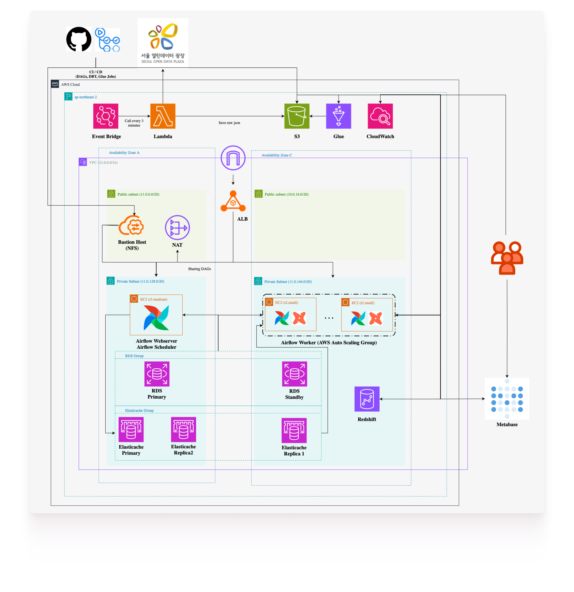

#  데이터로 보는 서울 

 

## 목차
1. [프로젝트 소개](#프로젝트-소개)
   - [프로젝트 개요](#프로젝트-개요)
   - [주제 선정 배경](#주제-선정-배경)
   - [프로젝트 목표](#프로젝트-목표)
2. [사용 기술](#사용-기술)
3. [아키텍처](#아키텍처)
4. [결과](#결과)
   - [실시간 탭](#실시간)
   - [주간 탭](#주간)
   - [인사이트 탭](#인사이트)
5. [성과](#성과)
6. [데이터 출처](#데이터-출처)

## 프로젝트 개요
서울 열린데이터 광장의 실시간 도시데이터 API를 활용하여 날씨, 상권, 인구, 교통, 문화행사 데이터를 수집 후 추출하고,  
AWS기반 데이터 파이프라인과 인터랙티브 대시보드를 구축하는 프로젝트입니다.

<a href="#목차">⬆ 목차로</a>

## 주제 선정 배경

- 서울시는 날씨, 상권, 인구, 교통, 문화행사 등 다양한 도시 데이터를 실시간 공공 API로 제공
- 각 데이터는 개별적으로는 유용하나, 서로 다른 포맷과 주기로 제공되어 통합 분석에 한계
- 산발적으로 제공되는 데이터로 인해 즉시적인 의사결정 지원 어려움

<a href="#목차">⬆ 목차로</a>

## 3. 프로젝트 목표

- **도시 데이터 통합 수집 및 적재**
    - 서울시 실시간 API로부터 인구, 상권, 교통, 날씨 데이터를 수집
    - 스타 스키마 기반 모델링 후 데이터 웨어하우스에 적재
- **AWS 기반 데이터 파이프라인 구축**
    - 데이터 수집, 처리, 저장, 분석까지의 흐름을 자동화
    - 실시간 데이터 흐름을 고려한 안정적인 아키텍처 설계
- **실시간 인터랙티브 대시보드 구현**
    - 주요 지표(시간대별 유동인구, 지역별 상권 변화 등) 시각화
    - 시간, 지역, 이벤트 등 필터링을 통해 상황별 인사이트 탐색 가능

<a href="#목차">⬆ 목차로</a>

## 사용 기술

| Category | Stacks |
|----------|-------|
| **Language** |   |
| **Data Pipeline / ETL** |      |
| **Storage** |     |
| **Visualization / Monitoring** |   |
| **Devops** |   |

<a href="#목차">⬆ 목차로</a>

## 아키텍처

<a href="#목차">⬆ 목차로</a>

## 결과

<table style="min-width: 100%; max-width: 830px; border-collapse: collapse; margin: 0 auto;">
  <!-- 실시간 탭 -->
  <tr id="실시간">
    <td align="center" valign="top" style="padding: 20px;">
        
      

        <strong>실시간 탭</strong> 
        실시간 탭은 82개 핫스팟이 위치한 <strong>서울</strong>의  
        종합적인 실시간 도시 정보를 모아서 보여줍니다.  
      

      
<a href="#목차">⬆ 목차로</a>

    </td>
  </tr>
  <!-- 주간 탭 -->
  <tr id="주간">
    <td align="center" valign="top" style="padding: 20px;">
        
      

        <strong>주간 탭</strong> 
        사용자가 드롭다운 리스트에서 특정 장소를 선택하면 
        해당 장소의 지난주 통계 정보를 제공합니다.  
      

      
<a href="#목차">⬆ 목차로</a>

    </td>
  </tr>
  <!-- 인사이트 탭 -->
  <tr id="인사이트">
    <td align="center" valign="top" style="padding: 20px;">
        
      

        <strong>인사이트 탭</strong> 
        사용자가 필터 조건을 직접 구성하여 
        소비 패턴과 유동인구 특성을 분석하고 정렬할 수 있습니다.  
      

      
<a href="#목차">⬆ 목차로</a>

    </td>
  </tr>
</table>

## 성과

서울시의 유동인구, 상권, 교통, 날씨, 이벤트 데이터를 통합하여, **실시간 변화와 주간 패턴을 한눈에 파악할 수 있는 두 종류의 대시보드**를 설계·구축했습니다.

특정 지역, 성별, 연령대 등 사용자 조건에 따라 데이터를 **필터링하고 시각적으로 탐색할 수 있는 인터랙티브 기능**을 구현하여, 사용자 중심의 데이터 경험을 제공했습니다.

이를 통해, 단순한 데이터 나열이 아닌 **문제 해결형 인사이트 도출이 가능한 구조**를 완성할 수 있었습니다.

<a href="#목차">⬆ 목차로</a>

## 데이터 출처

- 서울 열린데이터 광장 (https://data.seoul.go.kr)

<a href="#목차">⬆ 목차로</a>

