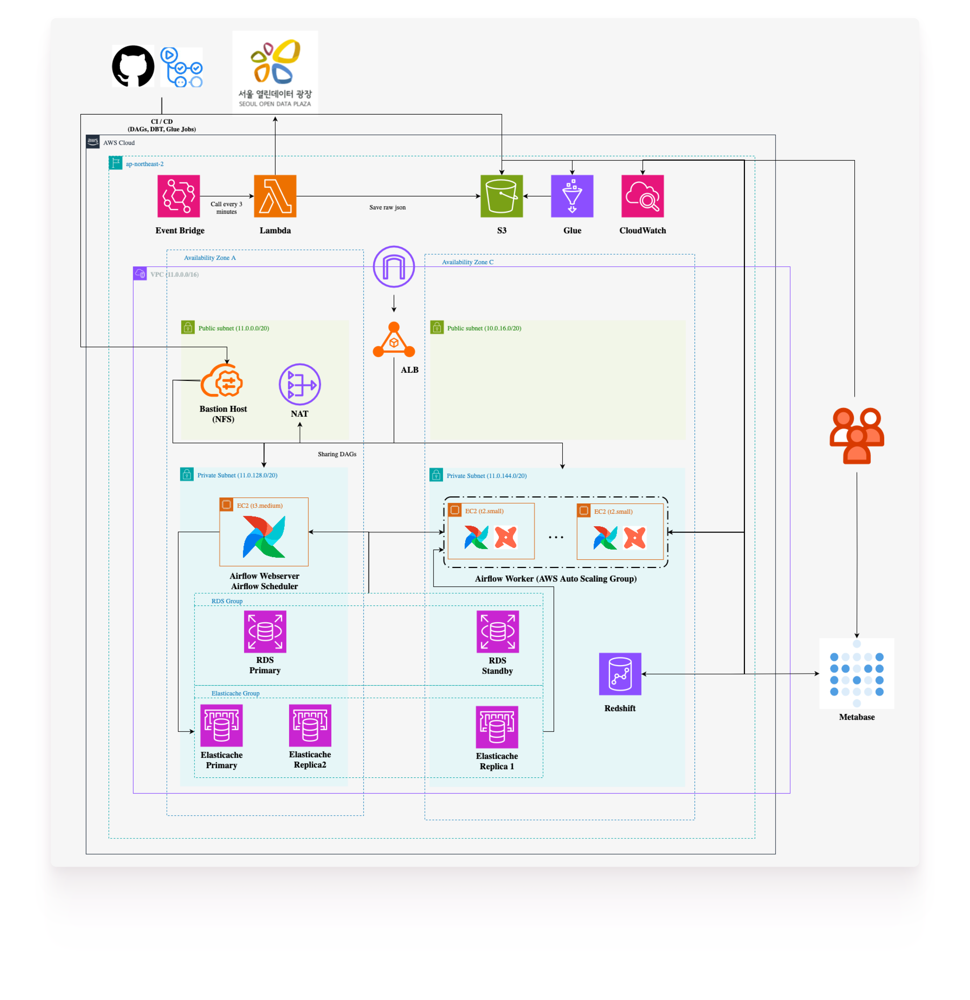

#  데이터로 보는 서울 

> 서울시 공공 API 기반 실시간 데이터 수집 및 AWS 기반 데이터 파이프라인·대시보드 구축  &nbsp;&nbsp; • <b>Data Engineering</b>

 

  
목차

  <ol>
    <li><a href="#프로젝트 소개">프로젝트 소개</a></li>
    <li><a href="#팀원 소개">팀원 소개</a></li>
    <li><a href="#사용 기술">사용 기술</a></li>
    <li><a href="#아키텍처">아키텍처</a></li>
    <li><a href="#결과">결과</a></li>
  </ol>

## 프로젝트 소개
서울 열린데이터 광장의 실시간 도시데이터 API를 활용하여 날씨, 상권, 인구, 교통, 문화행사 데이터를 통합 수집·분석하고, AWS 기반 데이터 파이프라인과 인터랙티브 대시보드를 구축하는 프로젝트입니다.

## 팀원 소개
|  |  |  |  |  |
|:---:|:---:|:---:|:---:|:---:|
| [정동영](https://github.com/Dong-yeong0) | [조원서](https://github.com/chowonseo) | [이승아](https://github.com/eelb07) | [서정원](https://github.com/pjy05079) | [최현욱](https://github.com/CHU4694) |

## 사용 기술

## 아키텍처

## Tech Stack 

| Category | Tools |
|----------|-------|
| Language |  |
| Data Pipeline / ETL |      |
| Cloud / Infra |     |
| Visualization / Monitoring |   |
| Communication / Collab |    |

  

## Dashboard

<table style="min-width: 100% !important; max-width: 830px !important; border-collapse: collapse;">
  <!-- 실시간 탭 -->
  <tr>
    <td align="center" valign="middle" width="80%">
      
    </td>
    <td align="center" valign="middle" width="20%">
      

        <strong>✅ 실시간</strong>  
        설명 설명 설명 설명 설명    
        설명 설명 설명 설명 설명 설명 설명 설명 설명 설명 
      

    </td>
  </tr>

  <!-- 주간 탭 -->
  <tr>
    <td align="center" valign="middle" width="80%">
      
    </td>
    <td align="center" valign="middle" width="20%">
      

        <strong>✅ 주간</strong>  
        설명 설명 설명 설명 설명    
        설명 설명 설명 설명 설명 설명 설명 설명 설명 설명 
      

    </td>
  </tr>

  <!-- 인사이트 탭 -->
  <tr>
    <td align="center" valign="middle" width="80%">
      
    </td>
    <td align="center" valign="middle" width="20%">
      

        <strong>✅ 인사이트</strong>  
        설명 설명 설명 설명 설명    
        설명 설명 설명 설명 설명 설명 설명 설명 설명 설명 
      

    </td>
  </tr>
</table>
